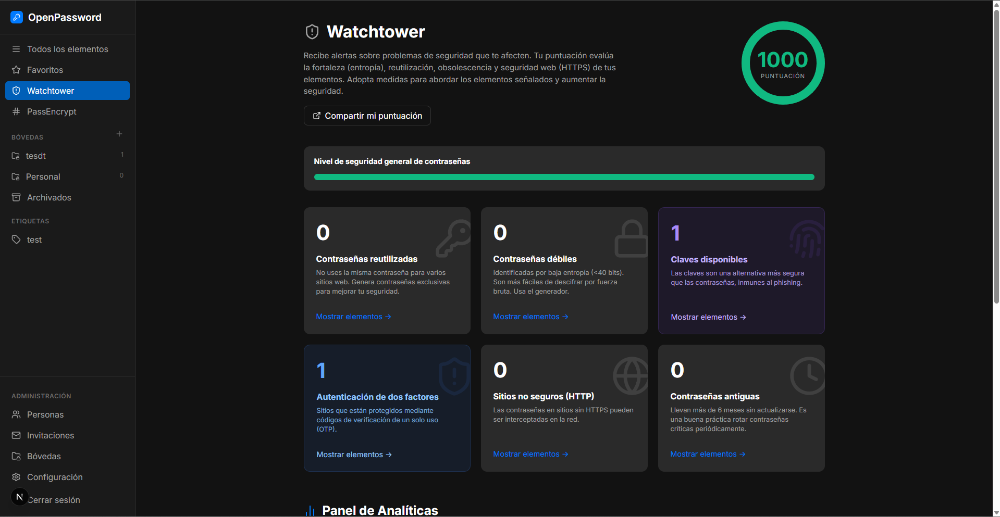
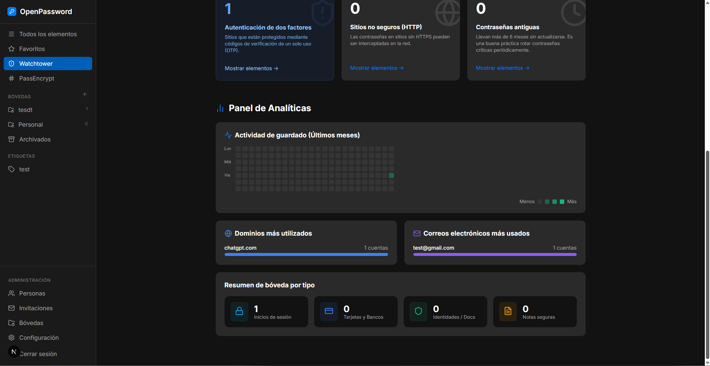
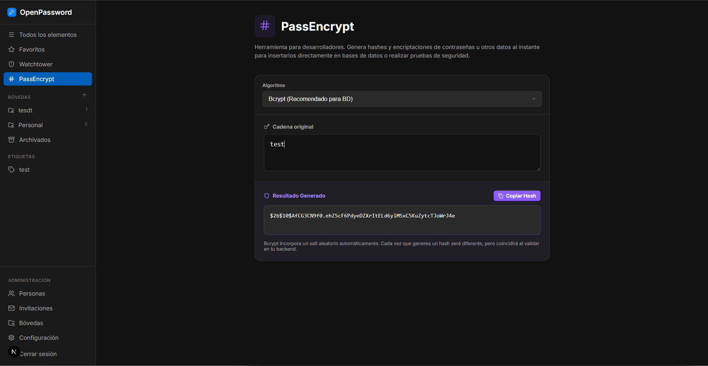

# Feature Guide

> A deep-dive into every major feature of OpenPassword.

---

## Table of Contents

1. [Item Management](#1-item-management)
2. [Vaults](#2-vaults)
3. [Password Generator](#3-password-generator)
4. [TOTP / One-Time Passwords](#4-totp--one-time-passwords)
5. [Passkeys (FIDO2)](#5-passkeys-fido2)
6. [Watchtower — Security Monitor](#6-watchtower--security-monitor)
7. [Analytics Panel](#7-analytics-panel)
8. [Item Sharing](#8-item-sharing)
9. [Private Permalinks](#9-private-permalinks)
10. [PassEncrypt](#10-passencrypt)
11. [Travel Mode](#11-travel-mode)
12. [Emergency Kit](#12-emergency-kit)
13. [Account Recovery](#13-account-recovery)
14. [Team & Invitations](#14-team--invitations)
15. [Internationalization (i18n)](#15-internationalization-i18n)
16. [Device Management](#16-device-management)
17. [SMTP Configuration](#17-smtp-configuration)

---

## 1. Item Management

OpenPassword supports **22 item categories**, each with a distinct icon and color:

| Category | Icon color | Use case |
|----------|-----------|----------|
| Login | Blue | Website credentials |
| Secure Note | Yellow | Private text notes |
| Credit Card | Blue-gray | Payment cards |
| Identity | Teal | Personal ID info |
| Passport | Indigo | Travel documents |
| Driver's License | Orange | ID documents |
| SSH Key | Slate | Server access keys |
| API Credential | Purple | API tokens & keys |
| Crypto Wallet | Yellow | Wallet seeds/keys |
| Email Account | Rose | Email credentials |
| Software License | Blue | License keys |
| Membership | Cyan | Club/service memberships |
| Router / WiFi | Green | Network credentials |
| Server | Dark | Server access |
| Database | Indigo | DB credentials |
| Medical Record | Pink | Health information |
| Insurance | Teal | Policy details |
| Investment Account | Emerald | Brokerage credentials |
| Reward Program | Amber | Loyalty point accounts |
| Social Security | Red | SSN / government IDs |
| Outdoor License | Green | Permits, hunting/fishing |
| Secure Document | Blue | Generic documents |

### Fields Available Per Item

**Standard fields** (always available):
- Title
- Username
- Password
- Website / URL
- Notes
- Tags

**Specialized fields** (appear based on category):
- OTP Secret (TOTP seed)
- Passkey
- Custom fields (unlimited, user-defined)

### Custom Fields

Click **"Add more"** in the item editor to add custom fields of any type:
- Text
- Password (masked)
- URL
- Email
- Date
- OTP (with live preview)
- Passkey

### Item Actions (Context Menu)

Right-click or use the **⋮** menu on any item to access:

| Action | Description |
|--------|-------------|
| Share | Generate a temporary public link |
| Add/Remove Favorite | Star the item |
| Move... | Reassign to a different vault |
| Duplicate... | Create a copy with "(copy)" suffix |
| Copy private link | Copy the item's permalink to clipboard |
| View history | Audit log of changes |
| Archive / Unarchive | Hide from main list |
| Delete | Permanently remove |

---

## 2. Vaults

Vaults are containers that group related items. Think of them like folders.

### Creating a Vault

Click the **+** next to "VAULTS" in the sidebar. A modal appears asking for a vault name. The vault is immediately created and visible in the sidebar.

### Travel Mode per Vault

Each vault can be flagged as **"safe for travel"** in the vault admin panel. When **Travel Mode** is enabled (in Settings), only safe-for-travel vaults are visible. This lets you cross borders without revealing sensitive vaults to customs inspections.

---

## 3. Password Generator

The password generator is accessible inside the item editor (below the password field) and generates cryptographically random passwords using `window.crypto`.

**Controls:**
- **Length**: slider from 8 to 64 characters
- **Numbers**: toggle inclusion of 0–9
- **Symbols**: toggle inclusion of `!@#$%^&*()`

Each time you adjust a control, a new password is generated. Click **Copy** to copy it to clipboard without applying it, or click the password in the item form to adopt it.

---

## 4. TOTP / One-Time Passwords

OpenPassword has a **built-in TOTP authenticator**. No external app (like Google Authenticator) needed.

### Adding a TOTP Secret

1. When editing an item, add a custom field of type **OTP**.
2. Paste the Base32 secret seed (e.g. `JBSWY3DPEHPK3PXP`).
3. A live preview of the current 6-digit code appears below the field.

### Viewing TOTP Codes

In the item detail view, the `one-time password` row shows:
- The **current 6-digit code** split as `XXX • XXX`
- A **circular countdown ring** showing the remaining seconds before the code rotates

Codes rotate every 30 seconds per the TOTP standard (RFC 6238).

---

## 5. Passkeys (FIDO2)

OpenPassword supports storing **passkey** credentials (FIDO2/WebAuthn).

### Creating a Passkey

In the item editor, click the fingerprint icon row to open the passkey creation modal. The simulation calls `navigator.credentials.create()` in a real environment. Accepted options:
- **Use your current device** — fingerprint or face recognition
- **Use your phone or another key** — external security key

Once created, the passkey is stored as a token on the item. In the detail view, a green **"Available for login"** badge confirms it is set.

---

## 6. Watchtower — Security Monitor



Watchtower continuously analyzes your vault and surfaces security issues.

### Security Score

The score ranges from **0 to 1000** and is color-coded:

| Score | Color | Meaning |
|-------|-------|---------|
| 800–1000 | 🟢 Green | Excellent |
| 500–799 | 🟡 Yellow | Needs attention |
| 0–499 | 🔴 Red | Critical |

### Six Metric Cards

| Metric | Description | Penalty |
|--------|-------------|---------|
| Reused passwords | Same password used across ≥2 sites | −300 pts (proportional) |
| Weak passwords | Entropy < 40 bits | −400 pts (proportional) |
| Available passkeys | Items with a passkey stored | +20 pts each |
| Active 2FA (OTP) | Items with a TOTP secret | +15 pts each |
| Unsecured HTTP sites | URLs starting with `http://` | −100 pts (proportional) |
| Old passwords | Not updated in 6+ months | −50 pts (proportional) |

Each card has a **"Show items →"** link that filters the item list to the affected items.

---

## 7. Analytics Panel



Scroll below the metric cards in Watchtower to reach the Analytics Panel.

### Save Activity Heatmap

A GitHub-style grid showing how many items were saved on each day over the past few months. Darker green = more activity.

### Top Domains

A ranked list of the most-used website domains in your vault, with a bar chart showing relative usage.

### Most-Used Emails

A ranked list of the email addresses used most frequently as usernames.

### Vault Summary by Type

A breakdown of your vault by item category (Logins, Cards & Banks, Identities / Docs, Secure Notes).

---

## 8. Item Sharing

You can share any item with someone who doesn't have an OpenPassword account using a **temporary public link**.

### Generating a Share Link

1. Open an item's context menu (**⋮**) and click **Share**.
2. Configure the link:
   - **Expiration**: 1 day, 7 days, or 30 days.
   - **Available for**: Anyone with the link (public) or specified people.
   - **View once**: The link is invalidated after the first view.
3. Click **Create link**. The URL appears and can be copied.

### What the Recipient Sees

The recipient opens `/share/[token]` — a minimal public page that shows the item's title, username, password (masked), URL, and expiration date. No login required.

---

## 9. Private Permalinks

Every item in OpenPassword has a **permanent private URL**:

```
http://your-domain.com/item/[item-id]
```

**How to use:**
- Click the **⋮** menu → **Copy private link** to copy it to your clipboard.
- The link works only while logged in (it's not public like a share link).

**Browser behavior:**
- The URL updates automatically as you navigate between items.
- You can bookmark any item URL for instant access.
- Pasting the URL in a new tab opens OpenPassword and automatically selects that item.

---

## 10. PassEncrypt



PassEncrypt is a **standalone developer utility** for cryptographic operations — useful for generating hashes to store in databases or verifying encoding schemes.

### Supported Algorithms

| Algorithm | Type | Use case |
|-----------|------|----------|
| **bcrypt** (10 rounds) | Hashing | Storing passwords in databases |
| **SHA-256** | Hashing | Data integrity |
| **SHA-512** | Hashing | Stronger data integrity |
| **MD5** | Hashing | Legacy checksum (not recommended for passwords) |
| **Base64 Encode** | Encoding | Encoding binary/text for transport |
| **Base64 Decode** | Decoding | Decoding Base64 strings |
| **AES Encrypt** | Encryption | Symmetric encryption with secret key |
| **AES Decrypt** | Decryption | Reversing AES encryption |
| **File → Base64** | Conversion | Convert any file to Base64 string |

### Usage

1. Select an algorithm from the dropdown.
2. Paste or type your input string (or upload a file for Base64 conversion).
3. The result appears instantly below.
4. Click **Copy Hash** to copy the result to clipboard.

> **Note:** bcrypt incorporates a random salt automatically. Each generation produces a different hash, but it will match when validated with `bcrypt.compare()` in your backend.

---

## 11. Travel Mode

Travel Mode lets you **hide sensitive vaults** when crossing international borders or in situations where you might be compelled to unlock your device.

### How it works

1. Go to **Settings** and mark specific vaults as "safe for travel" in the Vault Admin panel.
2. Enable **Travel Mode** in Settings → the toggle sends a `PUT /api/user` request with `{ travelMode: true }`.
3. The page reloads. Only vaults marked as safe for travel appear in the sidebar and item list.
4. Disable Travel Mode to restore full access.

---

## 12. Emergency Kit

The **Emergency Kit** is a PDF document you can download from Settings. It contains:

- Your account email address
- Your **Secret Key** (in the `A3-XXXXXX-XXXXXX-...` format)
- A QR code encoding the Secret Key
- Instructions for account recovery

**Store it somewhere safe** — printed out and locked away, or in a secure offline location. OpenPassword cannot recover your Secret Key or master password if you lose both.

---

## 13. Account Recovery

If you lose your master password, you can set up a **recovery code** as a backup:

1. Go to **Settings** → **Configure recovery code**.
2. A recovery code is generated and shown. Save it securely.
3. Identity verification happens via email (requires SMTP to be configured).

---

## 14. Team & Invitations

OpenPassword includes basic **team collaboration** features.

### Inviting a Member

1. Go to **Invitations** in the sidebar.
2. Enter the invitee's email address.
3. OpenPassword sends an invitation email (requires SMTP configuration in Settings).
4. The invitation appears in the list as "Pending" until accepted.

### Managing Members

The **People** view shows all active team members with:
- Name and email
- Role (Admin, Member, etc.)
- Status (Active, Inactive)

---

## 15. Internationalization (i18n)

OpenPassword ships with full bilingual support: **English** and **Spanish**.

### Changing Language

1. Go to **Settings**.
2. Click the language toggle button (shows the language you'll switch **to**).
3. The UI updates **instantly** — no page reload.

### How it works

- All UI strings are stored in `src/utils/i18n.ts` as a keyed dictionary for `es` and `en`.
- Each component reads the user's language preference on mount via `GET /api/user`.
- When the language changes, a `languageChanged` custom DOM event is dispatched, and all mounted components update simultaneously.
- The preference is saved to the database so it persists across sessions and devices.

---

## 16. Device Management

The **Settings → "Linked to your account"** section shows every browser session that has logged into your account:

| Column | Description |
|--------|-------------|
| Device name | Browser + OS detected from User-Agent |
| IP address | IP at time of last access |
| Location | Geolocation lookup (or "Local" for private IPs) |
| Last access | Timestamp of most recent activity |
| Current | Badge on the active session |

Click **"Disconnect all inactive"** to revoke all sessions except the current one.

---

## 17. SMTP Configuration

To send invitation emails, configure your SMTP server in **Settings → More actions → SMTP**.

**Required fields:**
- SMTP Host (e.g. `smtp.gmail.com`)
- SMTP Port (e.g. `587` for TLS)
- SMTP Username (usually your email address)
- SMTP Password (use an App Password for Gmail)

These values are stored encrypted in the database and used by the `/api/invitations` endpoint to send emails via Nodemailer-compatible transports.
